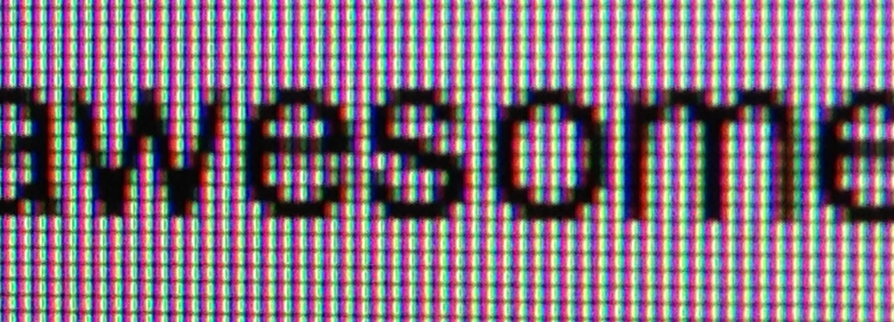
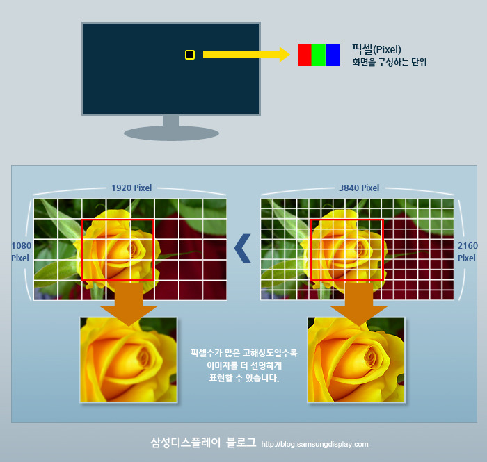

## 1. 키워드

각 프로퍼티에 따라 사용할 수 있는 키워드가 존재한다. 예를 들어 display 프로퍼티의 값으로 사용할 수 있는 키워드는 block, inline, inline-block, none이 있다. 자세한 내용은 각각의 프로퍼티를 참조하기 바란다.

CSS 프로퍼티에는 키워드, 크기 단위, 색상 표현 단위 등의 특정 단위를 갖는 값을 지정한다.

## 2. 크기 단위

cm, mm, inch 등의 단위도 존재하나 CSS에서 사용하는 대표적인 크기 단위는 px, em, %이다.

px은 절대값이고 em, %는 상대값이다.

대부분 브라우저의 폰트 사이즈 기본값은 16px, 1em, 100%이다. 프로퍼티 값이 0인 경우, 단위를 생략할 수 있다.

### 2.1 px

px은 픽셀(화소) 단위이다. 1px은 화소 1개 크기를 의미한다. 22인치 LCD 모니터의 경우 해상도가 1680 _ 1050 인데 이것은 가로에 1680개의 픽셀, 세로에 1050개의 픽셀을 가진다는 의미이다. 200만 화소(픽셀)의 디지털 카메라로 찍은 사진은 1600 _ 1200 = 1,920,000으로 통상 200만 화소라 한다.

스크린에서 확대한 픽셀. 각 픽셀들은 적색, 녹색, 청색 요소들(RGB)을 가지고 있다.

픽셀은 디바이스 해상도(resolution)에 따라 상대적인 크기를 갖는다.

이와 같이 디바이스 별로 픽셀(화소)의 크기는 제각각이기 때문에 픽셀을 기준으로 하는 단위는 명확하지 않다. 따라서 대부분의 브라우저는 1px을 1/96 인치의 절대단위로 인식한다.

px은 요소의 크기나 이미지의 크기 지정에 주로 사용된다.

### 2.2 %

%는 백분률 단위의 상대 단위이다. 요소에 지정된 사이즈(상속된 사이즈나 디폴트 사이즈)에 상대적인 사이즈를 설정한다.

### 2.3 em

em은 배수(倍數) 단위로 상대 단위이다. 요소에 지정된 사이즈(상속된 사이즈나 디폴트 사이즈)에 상대적인 사이즈를 설정한다. 예를 들어 1em은 요소에 지정된 사이즈와 같고 2em은 요소에 지정된 사이즈의 2배이다.

폰트 사이즈 설정이나 콘텐츠를 포함하는 컨테이너의 크기 설정에 사용하면 상대적인 설정이 가능하여 편리하다.

중첩된 자식 요소에 em을 지정하면 모든 자식 요소의 사이즈에 영향을 미치기 때문에 주의하여야 한다.

의도되지 않은 상황이라면 무척 난감한 상황일 수 있다. 즉, 상대 단위인 em의 기준이 상속의 영향으로 바뀔 수 있기 때문이다.

### 2.4 rem

em의 기준은 상속의 영향으로 바뀔 수 있다. 즉, 상황에 따라 1.2em은 각기 다른 값을 가질 수 있다.

rem은 최상위 요소(html)의 사이즈를 기준으로 삼는다. rem의 r은 root를 의미한다.

사용자가 브라우저의 기본 폰트 크기를 변경(Mac Chrome의 경우, 설정 > 고급 설정 표시 > 웹 콘텐츠 > 글꼴 맞춤 설정)하더라도 이에 따라 웹사이트의 레이아웃을 적절히 조정할 수 있다는 장점이 있다. 따라서 폰트 사이즈 뿐만이 아니라 콘텐츠의 크기에 따라 가변적으로 대응하여야 하는 wrapper 요소(container) 등에 적합하다.

Reset CSS를 사용하여 사전에 html 요소의 font-size 지정이 필요하다. font-size 미지정 시에는 16px가 적용된다.

### 2.5 Viewport 단위(vh, vw, vmin, vmax)

반응형 웹디자인은 화면의 크기에 동적으로 대응하기 위해 % 단위를 자주 사용한다. 하지만 % 단위는 em과 같이 상속에 의해 부모 요소에 상대적 영향을 받는다.

Viewport 단위는 상대적인 단위로 viewport를 기준으로 한 상대적 사이즈를 의미한다.

vw viewport 너비의 1/100  
vh viewport 높이의 1/100  
vmin viewport 너비 또는 높이 중 작은 쪽의 1/100  
vmax viewport 너비 또는 높이 중 큰 쪽의 1/100

예를 들어 viewport 너비가 1000px, 높이가 600px인 경우,

-   1vw : viewport 너비 1000px의 1%인 10px
-   1vh : viewport 높이 600px의 1%인 6px
-   vmin : viewport 높이 600px의 1%인 6px
-   vmax : viewport 너비 1000px의 1%인 10px

IE 8 이하는 지원하지 않으며 IE 9 ~ 11, Edge는 지원이 완전하지 않으므로 주의가 필요하다.

## 3. 색상 표현 단위

색상을 지정하기 위해 키워드(red, blue…)를 사용할 수 있다. 사용이 간편하다는 장점이 있으나 표현할 수 있는 색상의 수는 제한된다.

색상를 표현할 수 있는 키워드 리스트는 W3C css3-color를 참고하기 바란다.

더욱 다양한 색상을 표현하기 위해 다음과 같은 색상 표현 단위를 사용할 수 있다. HTML COLOR CODES를 참조하면 편리하다.

HEX 코드 단위 (Hexadecimal Colors) #000000  
RGB (Red, Green, Blue) rgb(255, 255, 0)  
RGBA (Red, Green, Blue, Alpha/투명도) rgba(255, 255, 0, 1)  
HSL (Hue/색상, Saturation/채도, Lightness/명도) hsl(0, 100%, 25%)  
HSLA (Hue, Saturation, Lightness, Alpha) hsla(60, 100%, 50%, 1)

출처 : https://poiemaweb.com/
