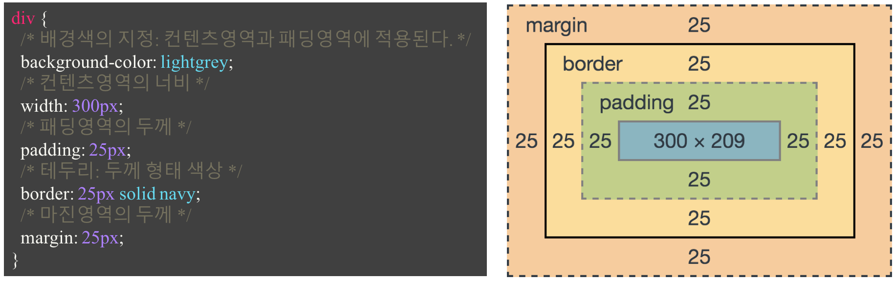
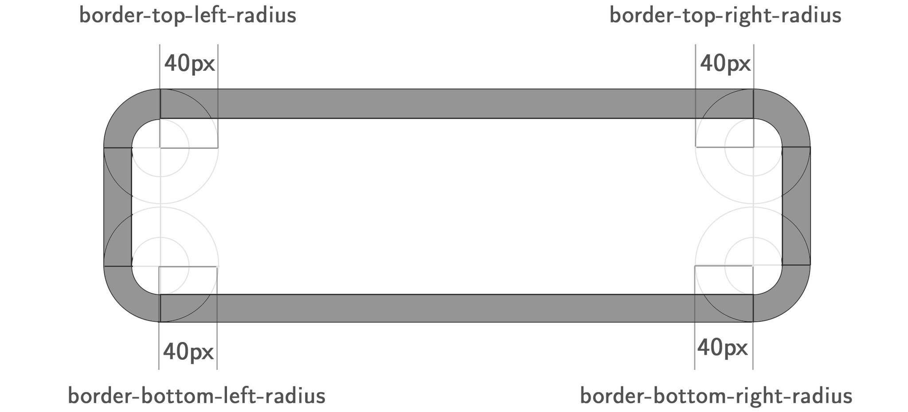
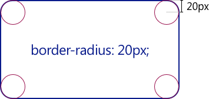

## 1. width / height 프로퍼티

모든 HTML 요소는 Box 형태의 영역을 가지고 있다. Box 형태란 물론 사각형을 의미한다.

이 Box는 콘텐트(Content), 패딩(Padding), 테두리(Border), 마진(Margin)로 구성된다.

브라우저는 박스 모델의 크기(dimension)와 프로퍼티(색, 배경, 모양 등), 위치를 근거로 하여 렌더링을 실행한다.

웹디자인은 콘텐츠를 담을 박스 모델을 정의하고 CSS 프로퍼티를 통해 스타일(배경, 폰트와 텍스트 등)과 위치 및 정렬을 지정하는 것이라고 할 수 있다.

Box 모델을 구성하는 콘텐트(Content), 패딩(Padding), 테두리(Border), 마진(Margin)에 대한 설명은 아래와 같다.

Content 요소의 텍스트나 이미지 등의 실제 내용이 위치하는 영역이다. width, height 프로퍼티를 갖는다.  
Padding 테두리(Border) 안쪽에 위치하는 요소의 내부 여백 영역이다. padding 프로퍼티 값은 패딩 영역의 두께를 의미하며 기본색은 투명(transparent)이다. 요소에 적용된 배경의 컬러, 이미지는 패딩 영역까지 적용된다.  
Border 테두리 영역으로 border 프로퍼티 값은 테두리의 두께를 의미한다.  
Margin 테두리(Border) 바깥에 위치하는 요소의 외부 여백 영역이다. margin 프로퍼티 값은 마진 영역의 두께를 의미한다. 기본적으로 투명(transparent)하며 배경색을 지정할 수 없다.

width와 height 프로퍼티는 요소의 너비와 높이를 지정하기 위해 사용된다. 이때 지정되는 요소의 너비와 높이는 콘텐츠 영역을 대상으로 한다.

이는 box-sizing 프로퍼티에 기본값인 content-box가 적용되었기 때문이다. box-sizing 프로퍼티에 border-box를 적용하면 콘텐츠 영역, padding, border가 포함된 영역을 width / height 프로퍼티의 대상으로 지정할 수 있다.

만일 width와 height로 지정한 콘텐츠 영역보다 실제 콘텐츠가 크면 콘텐츠 영역을 넘치게 된다는 것에 유의하여야 한다.

overflow: hidden;을 지정하면 넘친 콘텐츠를 감출 수 있다.

기본적으로 width와 height 프로퍼티는 콘텐츠 영역을 대상으로 요소의 너비와 높이를 지정하므로 박스 전체 크기는 다음과 같이 계산할 수 있다.

전체 너비  
width + left padding + right padding + left border + right border + left margin + right margin

전체 높이  
height + top padding + bottom padding + top border + bottom border + top margin + bottom margin

Width  
492px = 20px + 6px + 20px + 400px + 20px + 6px + 20px

Height  
192px = 20px + 6px + 20px + 100px + 20px + 6px + 20px

width와 height 프로퍼티의 초기값은 auto로써 이것은 브라우저가 상황에 따라 적당한 width와 height 값을 계산할 것을 의미한다.

예를 들어 block 요소의 경우, width는 부모 요소의 100%, height는 콘텐츠의 높이(+ 약간의 여분)가 지정된다.

width와 height 프로퍼티를 비롯한 모든 박스모델 관련 프로퍼티(margin, padding, border, box-sizing 등)는 상속되지 않는다.

## 2. margin / padding 프로퍼티

margin / padding 프로퍼티는 content의 4개 방향(top, right, left, bottom)에 대하여 지정이 가능하다.

-top, -right, -bottom, -left 4방향의 프로퍼티를 각각 지정하지 않고 margin, padding 1개의 프로퍼티만으로 4방향의 프로퍼티를 한번에 지정할 수 있다.

4개의 값을 지정할 때  
margin: 25px 50px 75px 100px;  
margin-top: 25px;  
margin-right: 50px;  
margin-bottom: 75px;  
margin-left: 100px;

3개의 값을 지정할 때  
margin: 25px 50px 75px;  
margin-top: 25px;  
margin-right: 50px; margin-left: 50px;  
margin-bottom: 75px

2개의 값을 지정할 때  
margin: 25px 50px;  
margin-top: 25px; margin-bottom: 25px;  
margin-right: 50px; margin-left: 50px;

1개의 값을 지정할 때  
margin: 25px;  
margin-top: 25px; margin-right: 25px; margin-bottom: 25px; margin-left: 25px;

margin 프로퍼티에 auto 키워드를 설정하면 해당 요소를 브라우저 중앙에 위치 시킬 수 있다.

보다 자세한 중앙 정렬 방법에 대해서는 Horizontal & Vertical Centering을 참조하기 바란다.

요소 너비가 브라우저 너비보다 크면 가로 스크롤바가 만들어진다. 이 문제를 해결하기 위해서 max-width 프로퍼티를 사용할 수 있다.

max-width 프로퍼티를 사용하면 브라우저 너비가 요소의 너비보다 좁아질 때 자동으로 요소의 너비가 줄어든다.

max-width 프로퍼티는 요소 너비의 최대값을, min-width 프로퍼티는 요소 너비의 최소값을 지정한다. 예를 들어 max-width: 300px;의 경우, 브라우저의 너비가 300px보다 작아지면 요소 너비는 브라우저의 너비에 따라서 작아진다. min-width: 300px;의 경우 브라우저의 너비가 300px보다 작아져도 요소 너비는 지정 너비(300px)을 유지한다.

## 3. border 프로퍼티

### 3.1 border-style

border-style 프로퍼티는 테두리 선의 스타일을 지정한다.

프로퍼티 값의 갯수에 따라 4개 방향(top, right, left, bottom)에 대하여 지정이 가능하다.

### 3.2 border-width

border-width 프로퍼티는 테두리의 두께를 지정한다. 프로퍼티 값의 갯수에 따라 4개 방향(top, right, left, bottom)에 대하여 지정이 가능하다.

border-width 프로퍼티는 border-style과 함께 사용하지 않으면 적용되지 않는다.

### 3.3 border-color

border-color 프로퍼티는 테두리의 색상을 지정한다. 프로퍼티 값의 갯수에 따라 4개 방향(top, right, left, bottom)에 대하여 지정이 가능하다.

border-color 프로퍼티는 border-style과 함께 사용하지 않으면 적용되지 않는다.

### 3.4 border-radius

border-radius 프로퍼티는 테두리 모서리를 둥글게 표현하도록 지정한다. 프로퍼티 값은 길이를 나타내는 단위(px, em 등)와 %를 사용한다. 각각의 모서리에 border-radius 프로퍼티를 개별적으로 지정할 수도 있고 4개의 모서리를 short-hand로 한번에 지정할 수도 있다.

하나 혹은 두개의 반지름을 설정하여 각각의 모서리 굴곡을 설정할 수 있기 때문에 원 혹은 타원의 모양으로 정의가 가능하다.

모든 모서리에 동일한 둥근 모서리 설정

각각의 모서리를 개별적으로 설정

두개의 반지름을 지정하여 타원형 둥근 모서리 설정

각각의 모서리에 타원형 둥근 모서리 축약 설정

### 3.5 border

border 프로퍼티는 border-width, border-style, border-color를 한번에 설정하기 위한 shorthand 프로퍼티이다.

## 4. box-sizing 프로퍼티

box-sizing 프로퍼티는 width, height 프로퍼티의 대상 영역을 변경할 수 있다.

box-sizing 프로퍼티의 기본값은 content-box이다. 이는 width, height 프로퍼티의 대상 영역이 content 영역을 의미한다. box-sizing 프로퍼티의 값을 border-box로 지정하면 마진을 제외한 박스 모델 전체를 width, height 프로퍼티의 대상 영역으로 지정할 수 있어서 CSS Layout을 직관적으로 사용할 수 있게 한다.

content-box width, height 프로퍼티 값은 content 영역을 의미한다. (기본값)  
border-box width, height 프로퍼티 값은 content 영역, padding, border가 포함된 값을 의미한다.

box-sizing 프로퍼티는 상속되지 않는다. 따라서 box-sizing 프로퍼티를 사용하도록 초기화하려면 아래와 같이 정의한다.

출처 : https://poiemaweb.com/
