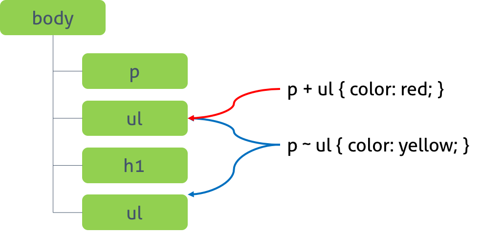

CSS(Cascading Style Sheets)는 HTML 요소(Element)의 style(design, layout etc)을 정의한다. 그리하려면 HTML이 존재하여야 하고 또한 style을 적용하고자하는 HTML 요소를 특정할 필요가 있다.

이러한 목적으로 사용되는 것이 셀렉터(Selector)이다. 즉, style을 적용하고자하는 HTML 요소를 셀렉터로 특정하고 선택된 요소에 스타일을 정의하는 것이다.

복수개의 셀렉터를 연속하여 지정할 수 있으며 쉼표( , )로 구분한다.

## 1. 전체 셀렉터 (Universal Selector)

HTML 문서 내의 모든 요소를 선택한다. html 요소를 포함한 모든 요소가 선택된다. (head 요소도 포함된다)

## 2. 태그 셀렉터 (Type Selector)

태그명 지정된 태그명을 가지는 요소를 선택한다.

## 3. ID 셀렉터 (ID Selector)

#id 어트리뷰트 값 id 어트리뷰트 값을 지정하여 일치하는 요소를 선택한다. id 어트리뷰트 값은 중복될 수 없는 유일한 값이다.

## 4. 클래스 셀렉터 (Class Selector)

.class 어트리뷰트 값 class 어트리뷰트 값을 지정하여 일치하는 요소를 선택한다. class 어트리뷰트 값은 중복될 수 있다.

HTML 요소에 class 어트리뷰트 값은 공백으로 구분하여 여러 개 지정할 수 있다. 아래와 같이 클래스 셀렉터를 사용하여 미리 스타일을 정의해 두고, HTML 요소는 이미 정의되어 있는 클래스를 지정하는 것으로 필요한 스타일을 지정할 수 있다. 이것은 재사용의 측면에서 유용하다.

## 5. 어트리뷰트 셀렉터 (Attribute Selector)

셀렉터[어트리뷰트] 지정된 어트리뷰트를 갖는 모든 요소를 선택한다.

셀렉터[어트리뷰트=”값”] 지정된 어트리뷰트를 가지며 지정된 값과 어트리뷰트의 값이 일치하는 모든 요소를 선택한다.

셀렉터[어트리뷰트~=”값”] 지정된 어트리뷰트의 값이 지정된 값을 (공백으로 분리된) 단어로 포함하는 요소를 선택한다.

셀렉터[어트리뷰트|=”값”] 지정된 어트리뷰트의 값과 일치하거나 지정 어트리뷰트 값 뒤 연이은 하이픈(“값-“)으로 시작하는 요소를 선택한다.

셀렉터[어트리뷰트^=”값”] 지정된 어트리뷰트 값으로 시작하는 요소를 선택한다.

셀렉터[어트리뷰트$=”값”] 지정된 어트리뷰트 값으로 끝나는 요소를 선택한다.

셀렉터[어트리뷰트*=”값”] 지정된 어트리뷰트 값을 포함하는 요소를 선택한다.

## 6. 복합 셀렉터 (Combinator)

### 6.1 후손 셀렉터 (Descendant Combinator)

자신의 1 level 상위에 속하는 요소를 부모 요소, 1 level 하위에 속하는 요소를 자손 요소(자식 요소)라한다.

자신보다 n level 하위에 속하는 요소는 후손 요소(하위 요소)라 한다.

셀렉터A 셀렉터B 후손 셀렉터는 셀렉터A의 모든 후손(하위) 요소 중 셀렉터B와 일치하는 요소를 선택한다.

### 6.2 자식 셀렉터 (Child Combinator)

셀렉터A > 셀렉터B 자손 셀렉터는 셀렉터A의 모든 자식 요소 중 셀렉터B와 일치하는 요소를 선택한다.

### 6.3 형제(동위) 셀렉터 (Sibling Combinator)

형제(동위) 셀렉터는 형제 관계(동위 관계)에서 뒤에 위치하는 요소를 선택할 때 사용한다.

#### 6.3.1 인접 형제 셀렉터(Adjacent Sibling Combinator)

셀렉터A + 셀렉터B 셀렉터A의 형제 요소 중 셀렉터A 바로 뒤에 위치하는 셀렉터B 요소를 선택한다. A와 B 사이에 다른 요소가 존재하면 선택되지 않는다.

#### 6.3.2 일반 형제 셀렉터(General Sibling Combinator)

셀렉터A ~ 셀렉터B 셀렉터A의 형제 요소 중 셀렉터A 뒤에 위치하는 셀렉터B 요소를 모두 선택한다.

## 7. 가상 클래스 셀렉터 (Pseudo-Class Selector)

가상 클래스는 요소의 특정 상태에 따라 스타일을 정의할 때 사용된다. 특정 상태란 예를 들어 다음과 같다.

-   마우스가 올라와 있을때
-   링크를 방문했을 때와 아직 방문하지 않았을 때
-   포커스가 들어와 있을 때

이러한 특정 상태에는 원래 클래스가 존재하지 않지만 가상 클래스를 임의로 지정하여 선택하는 방법이다.

가상 클래스는 마침표(.) 대신 콜론(:)을 사용한다. CSS 표준에 의해 미리 정의된 이름이 있기 때문에 임의의 이름을 사용할 수 없다.

다음은 div 요소가 hover 상태일 때(마우스가 올라와 있을 때) background-color를 yellow로 지정하는 예이다.

### 7.1 링크 셀렉터(Link pseudo-classes), 동적 셀렉터(User action pseudo-classes)

:link 셀렉터가 방문하지 않은 링크일 때  
:visited 셀렉터가 방문한 링크일 때  
:hover 셀렉터에 마우스가 올라와 있을 때  
:active 셀렉터가 클릭된 상태일 때  
:focus 셀렉터에 포커스가 들어와 있을 때

### 7.2 UI 요소 상태 셀렉터(UI element states pseudo-classes)

:checked 셀렉터가 체크 상태일 때  
:enabled 셀렉터가 사용 가능한 상태일 때  
:disabled 셀렉터가 사용 불가능한 상태일 때

### 7.3 구조 가상 클래스 셀렉터(Structural pseudo-classes)

:first-child 셀렉터에 해당하는 모든 요소 중 첫번째 자식인 요소를 선택한다.  
:last-child 셀렉터에 해당하는 모든 요소 중 마지막 자식인 요소를 선택한다.

:nth-child(n) 셀렉터에 해당하는 모든 요소 중 앞에서 n번째 자식인 요소를 선택한다.  
:nth-last-child(n) 셀렉터에 해당하는 모든 요소 중 뒤에서 n번째 자식인 요소를 선택한다.

n은 0부터 시작하는 정수이다.

:first-of-type 셀렉터에 해당하는 요소의 부모 요소의 자식 요소 중 첫번째 등장하는 요소를 선택한다.  
:last-of-type 셀렉터에 해당하는 요소의 부모 요소의 자식 요소 중 마지막에 등장하는 요소를 선택한다.  
:nth-of-type(n) 셀렉터에 해당하는 요소의 부모 요소의 자식 요소 중 앞에서 n번째에 등장하는 요소를 선택한다.  
:nth-last-of-type(n) 셀렉터에 해당하는 요소의 부모 요소의 자식 요소 중 뒤에서 n번째에 등장하는 요소를 선택한다.

### 7.4 부정 셀렉터(Negation pseudo-class)

:not(셀렉터) 셀렉터에 해당하지 않는 모든 요소를 선택한다.

### 7.5 정합성 체크 셀렉터(validity pseudo-class)

:valid(셀렉터) 정합성 검증이 성공한 input 요소 또는 form 요소를 선택한다.  
:invalid(셀렉터) 정합성 검증이 실패한 input 요소 또는 form 요소를 선택한다.

## 8. 가상 요소 셀렉터 (Pseudo-Element Selector)

가상 요소는 요소의 특정 부분에 스타일을 적용하기 위하여 사용된다. 특정 부분이란 예를 들어 다음과 같다.

-   요소 콘텐츠의 첫글자 또는 첫줄
-   요소 콘텐츠의 앞 또는 뒤

가상 요소에는 두개의 콜론(::)을 사용한다. CSS 표준에 의해 미리 정의된 이름이 있기 때문에 임의의 이름을 사용할 수 없다.

::first-letter 콘텐츠의 첫글자를 선택한다.  
::first-line 콘텐츠의 첫줄을 선택한다. 블록 요소에만 적용할 수 있다.  
::after 콘텐츠의 뒤에 위치하는 공간을 선택한다. 일반적으로 content 어트리뷰트와 함께 사용된다.  
::before 콘텐츠의 앞에 위치하는 공간을 선택한다. 일반적으로 content 어트리뷰트와 함께 사용된다.  
::selection 드래그한 콘텐츠를 선택한다. iOS Safari 등 일부 브라우저에서 동작 않는다.

출처 : https://poiemaweb.com/
